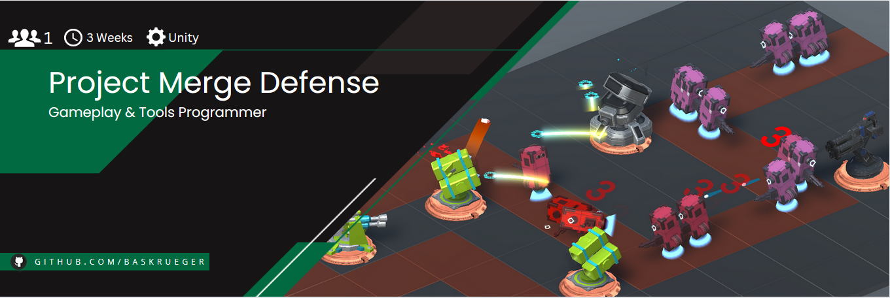
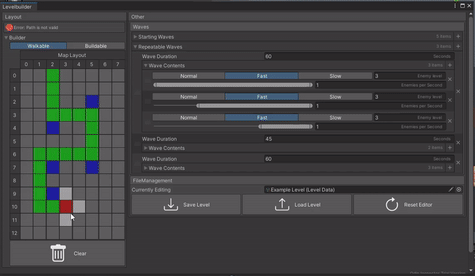

# Project Merge Defense

     

Project Merge Defense is a prototype for a tower defense game on Android that I build from scratch using C# and the Unity Engine.
This side project was created as a way for me to learn more about tool programming, aswell as creating the foundation for a fun tower defense/merge hybrid to potentially continue working on in the future.

# Gameplay
https://github.com/BasKrueger/MergeDefense/assets/147401575/a3195c6a-e012-44cb-a07e-b2e2bcf9b35b

The main premise of this Tower Defense game is that you can only buy random turrets and you upgrade them by merging two of the same kind and level together. Carefully managing your limited tiles where you can build and merge your turrets is key to victory.
Try it out yourself at https://suchti0352.itch.io/project-merge-defense.

# Highlight Levelbuilder

     

Levels were crafted within the custom Levelbuilder Window.
Features include:

- easy and save way to build level layouts.
- simple way to design enemy waves. Including the duration, when which enemy type gets spawned and more.
- create, save and load levels as simple scriptable objects.

# Acknowledgements
Project Merge Defense makes use of the [Odin Inspector](https://odininspector.com/) plugin. 
Aswell as the following Assetpacks:
 - [Robo's turret (free sample)](https://assetstore.unity.com/packages/3d/environments/sci-fi/robo-s-turret-free-sample-147413)
 - [Fatty Poly Turret Free](https://assetstore.unity.com/packages/3d/props/weapons/fatty-poly-turret-free-155251)
 - [Fatty Poly Turret Part 2 Free](https://assetstore.unity.com/packages/3d/props/weapons/fatty-poly-turret-part-2-free-159989)
 - [Sci Fi Doors](https://assetstore.unity.com/packages/3d/environments/sci-fi/sci-fi-doors-162876)
 - [Tiny Robots Pack](https://assetstore.unity.com/packages/3d/characters/robots/tiny-robots-pack-98930)
 - [Sci-Fi UI Components Pack](https://assetstore.unity.com/packages/2d/gui/sci-fi-ui-components-pack-106382)
 - [52 Special Effects Pack](https://assetstore.unity.com/packages/vfx/particles/spells/52-special-effects-pack-10419)
 - [Particle Pack](https://assetstore.unity.com/packages/vfx/particles/particle-pack-127325)
